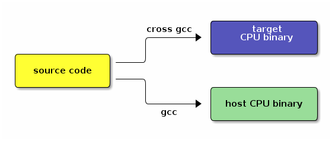

# Embedded Control Systems for Intelligent Mechanics - Assignments

## Table of Contents

*   [Practical Information](#practical-information)
*   [Assignment 1: The Command Line](#the-command-line)
*   [Assignment 2: Editors](#editors)
*   [Assignment 3: Compiling and Makefiles](#compiling-and-makefiles)
    *   [Compilation](#compilation)
    *   [Makefiles](#makefiles)
*   [Assignment 4: Debugging techniques](#debugging-techniques)
*   [Assignment 5: Version control](#version-control)
    *   [git overview](#git-overview)
    *   [Some remarks](#some-remarks)
*   [Assignment 6: cross development](#cross-development)
    *   [Cross compilation](#cross-compilation)
    *   [Connecting to the target system](#connecting-to-the-target-system)
*   [Appendix](#appendix)
*   [Acknowledgements](#acknowledgements)


## Practical Information

<div class="figure">
<p></p>
<p>BeagleBoard (source: Wikipedia)</p>
</div>


The assignments can be carried out on the Ubuntu Gnu/Linux PCs in the
Robot Lab, C300, first floor. You should be able to log in with your
s-number. Working through each assignment should take no longer than 3
hours. Please report any problems such as non-working commands or problems
with the robots on the course mailing list, but be sure to adhere to
the [Netiquette](http://en.wikipedia.org/wiki/Netiquette). Try to formulate [smart questions](http://www.catb.org/~esr/faqs/smart-questions.html) and give efficient
answers, keeping in mind that communication is a skill which is also
being evaluated.

The embedded system used throughout the assingnments is the
[BeagleBoard-xM](http://en.wikipedia.org/wiki/BeagleBoard).

While the first two assignments can be carried out on any modern Linux
computer, the later ones depend on specific tools which are setup in
the Robot Lab.


## Assignment 1: The Command Line


The purpose of this first assignment is to familiarize yourself with
an essential concept of embedded systems: the command line. The
command line provides a low level but yet powerful interface to the
system. Especially in embedded system development it is often the
**only** way to interact with the system. The
[FLOSS command line book](http://en.flossmanuals.net/command-line/)
gives a excellent introduction. It is suggested to read at least to
Chapter _Commands_. Of course you should use further information where
necessary.

After reading the basic introduction, you should be able to answer (or
quickly find out the answer to) the following questions:

1.  which methods exist of getting help on the command line?

2.  what do `pwd`, `ls`, `cd` do?

3.  what is the difference between an absolute and relative path?

4.  which information does `ls -l` display?

5.  what does the `file` command do?

6.  how can you find a file located somewhere in a directory?

7.  what do `ps`, `top`, `kill` do?

8.  what does mounting mean?

9.  what are environment variables and how can they be set and shown?

10.  What is the `$PATH` environment variable used for?

Final note: throughout the assignments commands to be executed will be
prefixed with a `$` sign as for example:

```
$ whoami
```


## Assignment 2: Editors


  The goal of this assignment to become familiar with an advanced
  editor which is suitable for programming. The FLOSS command line
  book has a general introduction to [editors](http://en.flossmanuals.net/command-line/ch033_text-editors) and especially to the [vi](http://en.flossmanuals.net/command-line/ch035_vim)
  editor, which we suggest you to get familiar with. The reason for
  this is that vi is available even on very small and resource limited
  embedded systems including the beagle board.

  After this introduction you should know how:

1.  the two modes of vi and how to switch between them

2.  how to open new or existing files

3.  how to move around and how to insert text

4.  how exit with or without saving the changes made

  Next step is to write a small shell script. Shell scripts are very
  useful to automate tasks instead of repeatively entering the same
  commands. An introduction can be found in the
  [FLOSS book](http://en.flossmanuals.net/command-line/ch040_scripting). A very thorough guide to shell scripting (using the Bash
  shell) can be found in the [Advanced Bash Scripting Guide](http://tldp.org/LDP/abs/html/). The following is an example of a script
  which checks if the internet connection is up and prints the result:

<pre class="src src-sh"><span id="coderef-bash_shebang" class="coderef-off"><span class="linenr">1:  </span><span style="color: #cd0000;">#</span><span style="color: #cd0000;">!/bin/</span><span style="color: #00cdcd; font-weight: bold;">bash</span><span style="color: #cd0000;"></span></span>
<span class="linenr">2:  </span>
<span id="coderef-bash_ping" class="coderef-off"><span class="linenr">3:  </span>ping -w3 -c 1 -q google.be &amp;&gt; /dev/null</span>
<span class="linenr">4:  </span>
<span id="coderef-bash_if" class="coderef-off"><span class="linenr">5:  </span><span style="color: #00cdcd; font-weight: bold;">if</span> [ $? -eq 0 ]; <span style="color: #00cdcd; font-weight: bold;">then</span></span>
<span id="coderef-bash_echo" class="coderef-off"><span class="linenr">6:  </span>    <span style="color: #0000cd; font-weight: bold;">echo</span> <span style="color: #00cd00;">"internet up"</span></span>
<span id="coderef-bash_else" class="coderef-off"><span class="linenr">7:  </span><span style="color: #00cdcd; font-weight: bold;">else</span></span>
<span class="linenr">8:  </span>    <span style="color: #0000cd; font-weight: bold;">echo</span> <span style="color: #00cd00;">"internet down"</span>
<span id="coderef-bash_fi" class="coderef-off"><span class="linenr">9:  </span><span style="color: #00cdcd; font-weight: bold;">fi</span></span>
</pre>

  The [first line](#coderef-bash_shebang) indicates that this script is to be executed with the
  `bash` shell, which is the most common shell today. The real program
  starts in line [3](#coderef-bash_ping). This line executes the `ping(1)`
  command, which checks wether a computer on a network is
  responding. Lookup the arguments on the `ping(1)` manpage. The `&amp;&gt;`
  line redirects the output of ping to `/dev/null`, which is a garbage
  bin for data. This is done so that when the script is run only the
  desired message and not the output of the ping command is shown.

  In line [5](#coderef-bash_if) it is checked if the ping was successful or
  not. For this the special variable `$?` is used, which always
  contains the return value of the last command executed. `$?` is
  compared to the value 0 which commonly indicates success. If this is
  true a positive status message is output in line [6](#coderef-bash_echo). In
  case the check was not true, the [else branch](#coderef-bash_else) is entered and a
  negative message printed. The [last line](#coderef-bash_fi) (which is `if` spelled
  backwards) ends the `if` block.

  Store the script in a file (`up.sh`). Next we need to make the
  script file executable. This can be done by setting the `x`
  (executable) bit on the file:

```
$ chmod +x up.sh
```
  and run it:

```
$ ./up.sh
internet up
```


## Assignment 3: Compiling and Makefiles


The purpose of this assignment is to introduce the concept of
compilation and the associated make tool. After this assignment you
should know:

1.  the structure of a simple C program

2.  How to compile C program

3.  How a basic Makefile looks like

4.  How to debug a C program using gdb

5.  What the strip command does


### Compilation


We start using the following simple C program:

<pre class="src src-c"><span id="coderef-simple-c_1" class="coderef-off"><span class="linenr">1:  </span><span style="color: #0000cd; font-weight: bold;">#include</span> <span style="color: #00cd00;">&lt;stdlib.h&gt;</span></span>
<span id="coderef-simple-c_2" class="coderef-off"><span class="linenr">2:  </span><span style="color: #0000cd; font-weight: bold;">#include</span> <span style="color: #00cd00;">&lt;stdio.h&gt;</span></span>
<span class="linenr">3:  </span>
<span id="coderef-simple-c_main" class="coderef-off"><span class="linenr">4:  </span><span style="color: #00cd00;">int</span> <span style="color: #0000cd; font-weight: bold;">main</span>(<span style="color: #00cd00;">int</span> <span style="color: #cdcd00;">argc</span>, <span style="color: #00cd00;">char</span> **<span style="color: #cdcd00;">argv</span>)</span>
<span class="linenr">5:  </span>{
<span id="coderef-simple-c_assignment" class="coderef-off"><span class="linenr">6:  </span>        <span style="color: #00cd00;">int</span> <span style="color: #cdcd00;">a</span> = 4711;</span>
<span id="coderef-simple-c_printf" class="coderef-off"><span class="linenr">7:  </span>        printf(<span style="color: #00cd00;">"hello world: %d\n"</span>, a);</span>
<span id="coderef-simple-c_return" class="coderef-off"><span class="linenr">8:  </span>        <span style="color: #00cdcd; font-weight: bold;">return</span>(EXIT_SUCCESS);</span>
<span class="linenr">9:  </span>}
</pre>

We start by explaining the program. The first two lines [1](#coderef-simple-c_1)
and [2](#coderef-simple-c_2) make available some standard program functions which
have been defined in different files. Line [4](#coderef-simple-c_main) defines the
main function, which is called when the program is started. The code
between the parentheses are two arguments which contain the values
which were given when the program was started on the command line. The
statement in line [6](#coderef-simple-c_assignment) create a variable `a` and
assigns the value 4711 to it. In line [7](#coderef-simple-c_printf) the printf
function os called (which is defined in the `stdio.h` library we
included in line [2](#coderef-simple-c_2)).  Finally in line [8](#coderef-simple-c_return) the
program returns from the main function and thereby end the
execution. It reports that everything went OK by returning
`EXIT_SUCCESS` (which is defined in `stdlib.h`)

Store the program in a file (`hello_world.c`). It can then be compiled
with the following command:

```
$ gcc hello_world.c -o hello_world
```

Running it produces the intended output.

```
$ ./hello_world
hello world: 4711
```

Questions:

*   Note the `./` before the file. What happens if it is omitted? Why?

*   What do the `file(1)` and the the `ldd(1)` command report when run
  on the compiled program?

*   What is the size of the binary?


### Makefiles


Next we extend the program with a loop:

<pre class="src src-c"><span style="color: #0000cd; font-weight: bold;">#include</span> <span style="color: #00cd00;">&lt;stdlib.h&gt;</span>
<span style="color: #0000cd; font-weight: bold;">#include</span> <span style="color: #00cd00;">&lt;stdio.h&gt;</span>

<span style="color: #00cd00;">int</span> <span style="color: #0000cd; font-weight: bold;">main</span>(<span style="color: #00cd00;">int</span> <span style="color: #cdcd00;">argc</span>, <span style="color: #00cd00;">char</span> **<span style="color: #cdcd00;">argv</span>)
{
        <span style="color: #00cd00;">int</span> <span style="color: #cdcd00;">i</span>;

        <span style="color: #00cdcd; font-weight: bold;">for</span>(i=0; i&lt;10; i++) {
                printf(<span style="color: #00cd00;">"hello world: %d\n"</span>, i);
        }
        <span style="color: #00cdcd; font-weight: bold;">return</span>(EXIT_SUCCESS);
}
</pre>

Now instead of running the gcc command again we write a Makefile. Take
a very quick look at the make(1) manpage to get an idea what this tool
does.

The Makefile for our `hello_world.c` program will contain the
following in a file called `Makefile`:

<pre class="src src-makefile"><span class="linenr">1:  </span><span style="color: #0000cd; font-weight: bold;">hello_world</span>: hello_world.c
<span class="linenr">2:  </span>        gcc hello_world.c -o hello_world
</pre>

Important: line 2 begins with a tab!

The meaning of this file is the following: in order to build the
_target_ `hello_world` (the target is the name before the ':') the
command in the second line needs to be executed. The file
`hello_world.c` after the `:` in the first line is a _prerequisite_,
which means that the target `hello_world` depends on this
file. Effectively this allows the make program to examine when the
prerequisite last changed and to invoke the compilation only when it
is necessary.

Now the program can be simply compiled by executing:

```
$ make
gcc hello_world.c -o hello_world
```

which compiles the program. Running make again

```
$ make
make: `hello_world' is up to date.
```

is not recompiled because make detects that the `hello_world` program
is up to date because none of its dependencies (the `hello_world.c`
file in our case) have changed.


## Assignment 4: Debugging techniques


There exist several ways to debug a C/C++ program. A simple and
therefore often used way is to add `printf` statements print the
values of variables and to identify where things go wrong. A more
powerful approach is to use a debugger such as gdb(1). Quickly take a
look at the gdb(1) manpage _DESCRIPTION_ section to get an idea.

In order to use gdb, a program needs to be compiled with debugging
information. This is done by providing the `-g` switch to the gcc
compiler.

<pre class="src src-makefile"><span style="color: #0000cd; font-weight: bold;">hello_world</span>: hello_world.c
        gcc -g hello_world.c -o hello_world
</pre>

The following shows a sample debugging session with gdb:

<pre class="example"><span class="linenr"> 1:  </span>gdb hello_world
<span class="linenr"> 2:  </span>GNU gdb (GDB) 7.2-debian
<span class="linenr"> 3:  </span>Copyright (C) 2010 Free Software Foundation, Inc.
<span class="linenr"> 4:  </span>License GPLv3+: GNU GPL version 3 or later &lt;http://gnu.org/licenses/gpl.html&gt;
<span class="linenr"> 5:  </span>This is free software: you are free to change and redistribute it.
<span class="linenr"> 6:  </span>There is NO WARRANTY, to the extent permitted by law.  Type "show copying"
<span class="linenr"> 7:  </span>and "show warranty" for details.
<span class="linenr"> 8:  </span>This GDB was configured as "x86_64-linux-gnu".
<span class="linenr"> 9:  </span>For bug reporting instructions, please see:
<span class="linenr">10:  </span>&lt;http://www.gnu.org/software/gdb/bugs/&gt;...
<span class="linenr">11:  </span>Reading symbols from /home/mk/work/Schulungen/ELI/hello_world/hello_world...done.
<span class="linenr">12:  </span>(gdb) break main
<span class="linenr">13:  </span>Breakpoint 1 at 0x4004f3: file hello_world.c, line 8.
<span class="linenr">14:  </span>(gdb) run
<span class="linenr">15:  </span>Starting program: /home/mk/work/Schulungen/ELI/hello_world/hello_world
<span class="linenr">16:  </span>Breakpoint 1, main (argc=1, argv=0x7fffffffd0c8) at hello_world.c:8
<span class="linenr">17:  </span>8       for(i=0; i&lt;10; i++) {
<span class="linenr">18:  </span>(gdb) n
<span class="linenr">19:  </span>9       printf("hello world: %d\n", i);
<span class="linenr">20:  </span>(gdb) n
<span class="linenr">21:  </span>hello world: 0
<span class="linenr">22:  </span>8       for(i=0; i&lt;10; i++) {
<span class="linenr">23:  </span>(gdb) n
<span class="linenr">24:  </span>9       printf("hello world: %d\n", i);
<span class="linenr">25:  </span>(gdb) n
<span class="linenr">26:  </span>hello world: 1
<span class="linenr">27:  </span>8       for(i=0; i&lt;10; i++) {
<span class="linenr">28:  </span>(gdb) print i
<span class="linenr">29:  </span>$2 = 1
<span class="linenr">30:  </span>(gdb) continue
<span class="linenr">31:  </span>Continuing.
<span class="linenr">32:  </span>hello world: 5
<span class="linenr">33:  </span>hello world: 6
<span class="linenr">34:  </span>hello world: 7
<span class="linenr">35:  </span>hello world: 8
<span class="linenr">36:  </span>hello world: 9
<span class="linenr">37:  </span>
<span class="linenr">38:  </span>Program exited normally.
<span class="linenr">39:  </span>(gdb) quit
</pre>

Some of the more important commands (Note: all commands can be
abreviated, e.g. `b` instead of `break` )

*   `help &lt;command&gt;` get some help

*   `run` runs (i.e. starts) a program

*   _breakpoints_

    *   `break x` sets a breakpoint on x, where x can be for instance a
      function or a line number as follows `b hello_world.c:10`;

    *   `info break` list all breakpoints

    *   `del break 1` deletes breakpoint number 1

*   `list` show the source code

*   `where` show where the program is currently executing

*   _TUI mode_: text user face mode. Sometimes it is nice to see the
    source code while debugging. TUI (=text user interface) does
    this. It can started while running gdb by pressing the command
    sequence `Ctrl-x a` (this means pressing the `Ctrl` and the `x`
    key together, then releasing both and pressing the `a` key. It can
    be exited again by repeating the same sequence.

*   `info` allows to inspect the system. E.g. `info regi` shows the
    current content of the cpu registers.

*   `print`

*   _Advancing the program_

    *   `next` runs the next line, but does not enter functions

        *   `step` executes the next line and <span style="text-decoration:underline;">does</span> enter functions

        *   `finish` executes until the end of the current function

        *   `continue` continue program execution until reaching a
      breakpoint or the end of program.

Further information can be found in the [gdb user manual](http://sourceware.org/gdb/current/onlinedocs/gdb/).


## Assignment 5: Version control


  Making use of version control tools is _essential_ for any
  professional software development by facilitating tracking of
  change. Although many different version control systems exist, all
  can be roughly divided into two categories: centralized or
  distributed. The centralized ones such as [subversion](http://subversion.tigris.org/) or [cvs](http://savannah.nongnu.org/projects/cvs) store
  all changes in a central repository, while with the distributed
  version control systems like [mercurial](http://mercurial.selenic.com/) or [git](http://git-scm.com/) there is no such
  central storage. Instead each developer has an individual copy of
  the whole repository (disk space is cheap nowadays!). The following
  gives a short introduction to git, which is one of the most widely
  used versions control systems. It assumes that git is installed.

  The steps carried out are:

1.  retrieving an existing repository

2.  examining its history

3.  examining changes

4.  storing the changes.


### git overview


  The first step is to retrieve (also called "to check out" a local
  copy of the remote repository. With git this is done with the
  `clone` command:

```
$ cd src/
$ git clone http://git.mech.kuleuven.be/~u0062335/traffic_control.git
Cloning into traffic_control...

remote: Counting objects: 97, done.
remote: Compressing objects: 100% (94/94), done.
remote: Total 97 (delta 56), reused 0 (delta 0)
Receiving objects: 100% (97/97), 17.52 KiB, done.
Resolving deltas: 100% (56/56), done.
```

  After this you have a local copy of the source code of the virtual
  traffic light in the `traffic_control` directory. Change to it and
  examine the history.

```
$ cd traffic_control
$ git log
```

  This shows the history of the repository starting from latest
  changes at the top. Pressing `q` will exit the [pager](http://en.wikipedia.org/wiki/Terminal_pager). The `gitk`
  program provides a fancier, graphical overview of the
  history. Simply run it in the `traffic_control` directory.

  Next step is to make some changes. Edit any of the files, e.g. the
  README. A summary of the current changes can be obtained with the
  git status command:

<pre class="src src-sh">$ git status
<span style="color: #cd0000;"># </span><span style="color: #cd0000;">On branch master</span>
<span style="color: #cd0000;"># </span><span style="color: #cd0000;">Your branch is ahead of 'origin/master' by 1 commit.</span>
<span style="color: #cd0000;">#</span>
<span style="color: #cd0000;"># </span><span style="color: #cd0000;">Changed but not updated:</span>
<span style="color: #cd0000;">#   </span><span style="color: #cd0000;">(use "git add &lt;file&gt;..." to update what will be committed)</span>
<span style="color: #cd0000;">#   </span><span style="color: #cd0000;">(use "git checkout -- &lt;file&gt;..." to discard changes in working directory)</span>
<span style="color: #cd0000;">#</span>
<span style="color: #cd0000;">#</span><span style="color: #cd0000;">modified:   README</span>
<span style="color: #cd0000;">#</span>
no changes added to commit (use <span style="color: #00cd00;">"git add"</span> and/or <span style="color: #00cd00;">"git commit -a"</span>)
$
</pre>

  This shows that the README file has been modified.

  A more detailed description of the changes with respect to the base
  version is shown by using the `git diff` command:

```
git diff
```

  The output has the following meaning: Lines starting with a minus
  have been removed while lines with a plus have been added. Assuming
  we are content with the changes made we now want to permanently
  store them in the repository. This is called _commiting_ the
  change. Don't worry about commiting a nonsense change, we can check
  out a fresh copy later.

  The following command will store _all_ local changes (the `-a`
  flag). You will be asked to enter a message describing the
  change. It is important to choose good commit messages for you and
  others to be able to understand later what was the purpose of the
  change. (_Side note_: the editor program opened is defined (among
  others) by the EDITOR environment variable, so you might want to set
  it to your preferred editor `export EDITOR=vi` beforehand)

``` 
git commit -a
```

  Now you should be able to see your change using `git log` or `gitk`.


### Some remarks


*   git is not considered to be intuitive to the newcomer. Especially
     the _staging area_, for instance explained [here](http://progit.org/book/ch2-2.html), can be
     confusing.

*   git does not replace making backups: as a git directory is self
     contained, removing the checked out directory erases all history.

*   Find out how to create a new git repository starting from some
     existing files. This does not have to be source code, git can be
     useful for tracking changes to any text documents.

  For more information consult the exhaustive [git documentation](http://git-scm.com/documentation).


## Assignment 6: cross development


### Cross compilation


In the last session we compiled a program to be executable on our
local computer (commonly called _host system_) which probably contains
an AMD or Intel CPU. However our _target_ embedded system, the
BeagleBoard, contains a [ARM](http://en.wikipedia.org/wiki/ARM_architecture) CPU which is quite different. Therefore
any program which must run on the Beagle Board needs to be compiled
specifically for this architecture.

In general there are two possible ways to do this:

1.  By compiling a program on the beagle board itself. This is called
   _native_ compilation.

2.  By compiling the program on the host system, **but** with a compiler
   which generates executable programs for a different CPU. Because of
   this asymmetry this process is called cross compilation

The following figure shows the two approaches:



Depending on the situation both approaches are usefull. Generally the
cross development approach has the advantage that the development can
take place on the host system opposed to the restricted embedded
target. We will explore both approaches.

A cross compilation environment is already installed on the lab PCs
under _opt/eldk-4.2_. You can check that it is available in your PATH
by writing `arm-` in a terminal window and hitting tab twice:

<pre class="src src-sh">$ arm-linux-gnueabi-
arm-linux-gnueabi-addr2line  arm-linux-gnueabi-elfedit    arm-linux-gnueabi-gcov-4.4   arm-linux-gnueabi-ranlib
arm-linux-gnueabi-ar         arm-linux-gnueabi-g++        arm-linux-gnueabi-gprof      arm-linux-gnueabi-readelf
arm-linux-gnueabi-as         arm-linux-gnueabi-g++-4.4    arm-linux-gnueabi-ld         arm-linux-gnueabi-size
arm-linux-gnueabi-c++filt    arm-linux-gnueabi-gcc        arm-linux-gnueabi-nm         arm-linux-gnueabi-strings
arm-linux-gnueabi-cpp        arm-linux-gnueabi-gcc-4.4    arm-linux-gnueabi-objcopy    arm-linux-gnueabi-strip
arm-linux-gnueabi-cpp-4.4    arm-linux-gnueabi-gcov       arm-linux-gnueabi-objdump
$ arm-linux-gnueabi-
</pre>

This shows the various tools which form the cross development
toolchain. They resemble the tools which are available on the host
platform but use the prefix `arm-linux-`. As we will see this allows
to quickly switch between cross and host development.

In order to cross compile our hello world program, all we need to do
is to extend our `Makefile`. The original version looks like this:

<pre class="example">hello_world: hello_world.c
        gcc hello_world.c -o hello_world
</pre>

We extend it like this.

<pre class="example">CC=$(CROSS_COMPILE)gcc

hello_world: hello_world.c
        ${CC} -g hello_world.c -o hello_world
</pre>

**Important**: remember that the space before `${CC}` is one **tab**!

The first line sets the variable `CC` to the value of the
`CROSS_COMPILE` environment variable plus the string `gcc`. The result
is then used as the compiler command. This way, if we don't set the
`CROSS_COMPILE` environment variable the compiler used will be the
standard `gcc`, so the program will be compiled for the host system as
before. But if we set `CROSS_COMPILE` to the value `arm-linux-` then
the cross compiler will be used so the program can run on the embedded
board.

<pre class="src src-sh">$ make <span style="color: #cdcd00;">CROSS_COMPILE</span>=arm-linux-gnueabi-
arm-linux-gcc -Wall -g hello_world.c -o hello_world
</pre>

Some questions:

*   What happens if we run the program?

*   What does the `file` command report when run the executable?


### Connecting to the target system


For testing a program we need to transfer it to the embedded system
and the run it there. For doing this we will use the two tools `scp`
and `ssh`. The first allows to securely copy files across a network.
The second allows to access a remote system by means of a command line
interface.

First let's connect with ssh to the beagle board (ip address is
192.168.10.65). The first time you might get a message about the RSA
fingerprint, which you should verify to be sure that you are
connecting to the right embedded board (and not to a fake system a
malicious user has setup)

If the fingerprint is
`ab:6d:2a:ef:15:24:68:40:c7:ad:7a:4e:55:26:67:19` everything is ok and
you can accept the key by typing `yes`. Next you will be promted for
the password, which is `ecs`.

<pre class="src src-sh">pma-robot-youbot /home/mk $ ssh ecs@192.168.10.65
The authenticity of host <span style="color: #00cd00;">'192.168.10.65 (192.168.10.65)'</span> can<span style="color: #00cd00;">'t be established.</span>
<span style="color: #00cd00;">RSA key fingerprint is ab:6d:2a:ef:15:24:68:40:c7:ad:7a:4e:55:26:67:19.</span>
<span style="color: #00cd00;">Are you sure you want to continue connecting (yes/no)? yes</span>
<span style="color: #00cd00;">Warning: Permanently added '</span>192.168.10.65<span style="color: #00cd00;">' (RSA) to the list of known hosts.</span>
<span style="color: #00cd00;">ecs@192.168.10.65'</span>s password:
Linux beagle1 2.6.37-x2 <span style="color: #cd0000;">#</span><span style="color: #cd0000;">1 SMP PREEMPT Wed Feb 2 20:59:40 UTC 2011 armv7l GNU/Linux</span>
Ubuntu 10.10

Welcome to Ubuntu!
 * Documentation:  https://help.ubuntu.com/

The programs included with the Ubuntu system are free software;
the exact distribution terms for each program are described<span style="color: #00cdcd; font-weight: bold;"> in</span> the
individual files<span style="color: #00cdcd; font-weight: bold;"> in</span> /usr/share/doc/*/copyright.

Ubuntu comes with ABSOLUTELY NO WARRANTY, to the extent permitted by
applicable law.

ecs@beagle1:~$
</pre>

Now we are remotely connected to the beagle board with the familar
command line interface. We can verify this is an ARM Processor based
Linux with the `uname` command:

<pre class="src src-sh">ecs@beagle1:~$ uname -a
Linux beagle1 2.6.37-x2 <span style="color: #cd0000;">#</span><span style="color: #cd0000;">1 SMP PREEMPT Wed Feb 2 20:59:40 UTC 2011 armv7l GNU/Linux</span>
</pre>

Next step is to create a folder with your s-number to which your
program can be copied. Because everybody is logged in using the same
username care needs to be taken to not interfere with each other.

<pre class="src src-sh">ecs@beagle1:~$ mkdir s0202242
ecs@beagle1:~$
</pre>

Next we switch to a terminal of the **host** system and copy our the
cross compiled program using the `scp` tool to the newly created
directory on the beagle board:

<pre class="src src-sh">$ scp hello_world ecs@192.168.10.65:/home/ecs/s0202242/  <span style="color: #cd0000;"># </span><span style="color: #cd0000;">replace this with your s-number!</span>
ecs@192.168.10.65<span style="color: #00cd00;">'s password:</span>
<span style="color: #00cd00;">hello_world                                                                          100% 6258     6.1KB/s   00:00</span>
<span style="color: #00cd00;">$</span>
</pre>

Next change to the directory and check the file was really copied there&hellip;

<pre class="src src-sh">ecs@beagle1:~$ cd s0202242
ecs@beagle1:~/s0202242$ ls
hello_world
</pre>

&hellip; and run it:

<pre class="src src-sh">ecs@beagle1:~/s0202242$ ./hello_world
hello world: 4711
ecs@beagle1:~/s0202242$
</pre>

Congratulations! You just successfully ran a program which was cross
compiled for an embedded system.


## Appendix


Date: 2014-02-14 11:51:49 CET

Author: Sebastian Blumenthal, Markus Klotzbuecher, Herman Bruyninckx (K.U.Leuven)

## Acknowledgements

Thanks to Markus Klotzbuecher. This tutorial is based on the following page: http://people.mech.kuleuven.be/~mklotzbucher/ecs-assignments/ecs.html
 
